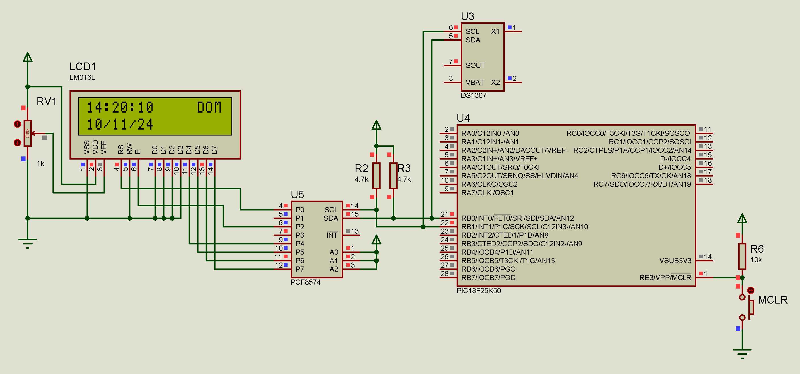

# RTC DS1307 com PIC18F25K50

Este projeto implementa um relógio em tempo real (RTC) utilizando o chip DS1307 em conjunto com um microcontrolador PIC18F25K50. O sistema exibe data, hora e dia da semana em um display LCD I2C.



## 🚀 Características

- Leitura e ajuste de data e hora através do DS1307
- Display de data no formato DD/MM/AA
- Display de hora no formato HH:MM:SS
- Indicação do dia da semana (DOM, SEG, TER, QUA, QUI, SEX, SAB)
- Comunicação I2C para RTC e LCD
- Atualização a cada segundo
- Interface amigável no display LCD
- Possibilidade de Backup de energia com bateria CR2032
- Precisão de tempo mantida mesmo sem energia principal

## 📋 Pré-requisitos

### Software
- mikroC PRO for PIC v7.6 (edição, compilação e debug do código fonte)
- Proteus v8.16 (para simulação)

### Hardware necessário:
- PIC18F25K50
- RTC DS1307
- Display LCD com módulo I2C
- Cristal de 32.768kHz para o RTC
- Bateria CR2032 para backup do RTC
- Resistores pull-up para I2C (4.7kΩ)

## 🔧 Conexões

### Pinagem do PIC18F25K50:
- RB0 (SDA) -> SDA do RTC e LCD
- RB1 (SCL) -> SCL do RTC e LCD
- VDD -> 5V
- VSS -> GND

### Pinagem do DS1307:
- SDA -> SDA do PIC
- SCL -> SCL do PIC
- VCC -> 5V
- GND -> GND
- X1, X2 -> Cristal 32.768kHz
- VBAT -> Bateria CR2032

## 📁 Estrutura do Projeto

```
RTC-DS1307-With-PIC18F25K50/
├── src/
│   ├── main.c
│   ├── RTC_DS1307_With_PIC18F25K50.hex
│   ├── RTC_DS1307_With_PIC18F25K50.cfg
│   ├── RTC_DS1307_With_PIC18F25K50.mcppi
│   └── bibis/
│       ├── lcd_i2c.c
│       ├── lcd_i2c.h
│       ├── rtc_ds1307.c
│       └── rtc_ds1307.h
├── img/
│   └── circuit.png
├── simulation/
│   └── RTC_DS1307_With_PIC18F25K50.pdsprj
├── doc/
│   ├── manual_mikroC-v101.pdf
│   ├── datasheet_ds1307.dpf
│   └── datasheet_pic18f25k50.pdf
├── .gitignore.md
├── license.md
└── readme.md
```

## 🛠️ Compilação e Simulação

1. Clone o repositório:
```bash
git clone https://github.com/genlicos/RTC-DS1307-With-PIC18F25K50.git
```

2. Abra o arquivo `src/RTC_DS1307_With_PIC18F25K50.mcppi` no mikroC PRO for PIC v7.6

3. Compile o projeto:
   - Faça as devidas modificações de sua preferência
   - Build o projeto (Ctrl+F9)
   - Firmware gerado `src/RTC_DS1307_With_PIC18F25K50.hex`

4. Para simulação:
   - Abra o arquivo `simulation/RTC_DS1307_With_PIC18F25K50.pdsprj` no Proteus
   - Execute a simulação

## 📄 Configuração Inicial

O código já vem com uma configuração inicial de data e hora que pode ser modificada alterando os valores no arquivo `src/RTC_DS1307_With_PIC18F25K50.c`:

```c
time.hours = 14;      // Hora inicial (24h)
time.minutes = 20;    // Minutos iniciais
time.seconds = 2;     // Segundos iniciais
time.weekday = 1;     // Dia da semana (1=Domingo,...,7=Sábado)
time.day = 10;        // Dia do mês
time.month = 11;      // Mês
time.year = 24;       // Ano
```

## ⚡ Características Técnicas

1. **Comunicação I2C**
   - Velocidade de comunicação: 100kHz
   - Pull-up resistor: 4.7kΩ
   - Endereço do RTC: 0xD0
   - Endereço do LCD: 0x4E

2. **Display LCD**
   - Interface I2C
   - 2 linhas x 16 caracteres
   - Atualização: 1 segundo

3. **RTC DS1307**
   - Precisão: ±2 segundos/dia de acordo com estudos
   - Backup: Bateria CR2032
   - Formato: 24 horas
   - Calendário completo até 2100

## 🌡️ Funcionamento

1. Na inicialização:
   - Seta o RTC de acordo com as configurações iniciais previstas

2. Em operação:
   - Exibe no display as informações de data, hora e dia da semana

## 🤝 Contribuindo

1. Faça um Fork do projeto
2. Crie uma Branch para sua modificação (`git checkout -b feature/AmazingFeature`)
3. Commit suas mudanças (`git commit -m 'Add some AmazingFeature'`)
4. Push para a Branch (`git push origin feature/AmazingFeature`)
5. Abra um Pull Request

## 📝 Licença

Este projeto está sob a licença MIT - veja o arquivo [LICENSE](license) para detalhes

## ✒️ Autor

* **Elison Nogueira** - *Trabalho Inicial* - [genlicos](https://github.com/genlicos)

## 🎁 Expressões de gratidão

* Compartilhe este projeto 📢
* Me Convide para uma cerveja 🍺
* Um agradecimento publicamente 🤝
